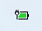

## Supported Version: V2022.1129
The bloody7.exe version of V2022.1129 is included in releases section too.
!!! Does not work without main app "Bloody7.exe". They should be both started !!!
## Battery icon
This is a small pet progect for educational purposes and can be used by anybody.

It shows in control panel a small battery icon with charge of battery of Bloody7 wireless mouse. 
### DarkTheme

### Light theme

## Author of BinarySharp
+ This developer and the copyright holder of BinarySharp library is ZenLulz (Jämes Ménétrey).
+ The official website of BinarySharp is www.binarysharp.com.
